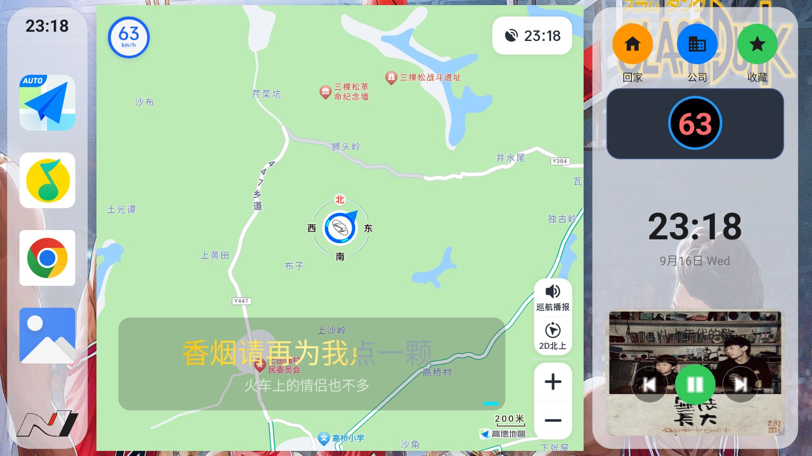
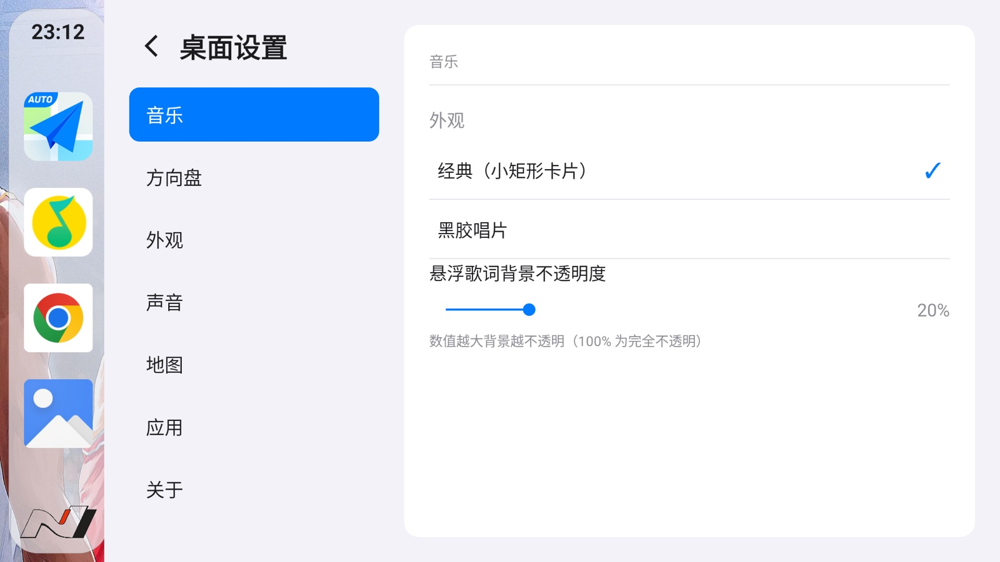

# NUI・车机桌面

**一个为车载场景而生的 Android 桌面启动器（Launcher）**

CarPlay 式布局・高德地图深度联动・导航 / 巡航信息 HUD・天气与语音・音乐控制





***

## ✨ 特性

### 🚗 地图与导航（高德车机版深度联动）


* **悬浮地图区域**：在桌面 page0 内嵌托管高德车机版悬浮地图窗，启动高德后自动返回桌面，地图常驻不挡操作

* **一键目的地**：回家 / 公司 / 收藏夹，URL Scheme 与广播双通道直达，未启动高德时自动兜底

* **右侧导航信息 HUD**（基于[高德车机版标准广播协议](doc/amap_auto_protocol.md)）：


  * **导航中**：当前车速（超速按程度四档变色）、到达时间、剩余距离、实时拥堵距离（随行驶递减、按拥堵程度着色）、限速值、摄像头距离、高速服务区名称与距离（含下一服务区预告）

  * **巡航中**：周边红绿灯（方位 / 距离）、变灯语音提醒、限速摄像头发现与 200 米二次语音提醒、通过提示音；有摄像头超速 10%、无摄像头超速 20% 才语音告警；巡航期间自动静音高德巡航播报，导航播报不受影响

  * 巡航 / 导航状态机严格按广播字段判定（ICON 转向标识 + 46/47 巡航进出广播）

* **昼夜外观跟随**：接收高德昼夜广播（10019），桌面整体深色 / 浅色实时切换

### 🎵 音乐控制


* Dock 绑定常用音乐 App（QQ 音乐 / QQ 音乐车机特殊版 / 酷我 / 网易云 / 酷狗 / Spotify 等，包名关键字模糊匹配，不依赖一一枚举）

* 通知监听 + MediaSession 双通道：播放 / 暂停 / 上下首、歌名歌手、专辑封面

* 桌面歌词（网易云歌词源；非标准 QQ 音乐包名及其它音乐软件统一走网易歌词）

* 播放器外观可选：**经典**（紧凑矩形控制条）/ **黑胶唱片**；无封面时自动紧凑布局

### 🌤️ 天气


* 首次启动 / 重大天气变化时，桌面播放**全屏透明天气动画**（晴 / 雨等粒子效果，短时自动消失），也可从独立入口进入完整天气页

* 开机语音问候：「主人 xx 好」+ 当日天气（在高德启动并返回桌面之后播报；查询不到天气时只报问候）

### 🗣️ 语音


* 基于**系统 TTS**（TextToSpeech），免下载模型、占用低，专为低性能车机设计

* 女声 / 男声偏好，自动检测引擎是否支持，不支持的音色置灰不可选；切换瞬间播报自我介绍

* 语音通道与业务解耦，天气、导航、按键反馈等所有场景共用

### 🖥️ 桌面与外观


* CarPlay 风格布局：**左侧 Dock**（地图、音乐两个固定绑定位 + 最近使用应用 + 自定义槽位，已在固定位的应用不重复占位）+ **右侧信息面板** + 中央时钟 / 壁纸

* **分页应用列表**：左右翻页（page0 为地图页），按页按需加载图标并缓存；有真实图标的应用优先排列，默认图标靠后；长按图标可卸载 / 隐藏，设置中可恢复隐藏应用

* **外观模式**：深色 / 浅色 / 跟随系统 / 跟随高德；白天 / 夜晚双壁纸槽位，跟随外观自动切换，缺省逐级回退

* Dock 形态（悬浮圆角 / 贴边矩形）、图标大小、DPI 均可调，布局按 DPI 与分辨率计算每页容量

* **状态栏与系统导航栏（系统 Dock）独立显隐开关**，开启后 NUI 各窗口按 inset 动态让位

### 🎛️ 车机专属


* **方向盘按键映射**：监听物理按键并映射到自定义操作（如切换系统 Dock 显隐等）

* **地图自启动时序可配**：桌面启动后第几秒拉起高德、拉起后第几秒返回桌面

* **长途休息提醒**：连续导航满 1.5 小时语音提醒休息，每次间隔 2 分钟、共 3 次，之后循环

* 一键重启桌面、关于页（作者 / 版本号）

## 📸 截图



## 🧭 适用环境


| 项目   | 要求                                                              |
| ---- | --------------------------------------------------------------- |
| 系统   | Android 5.0（API 21）及以上，横屏车机；在 Android 9 车机实测                    |
| 架构   | ARM 32 位（armeabi-v7a）/ ARM 64 位（arm64-v8a），按架构分包                |
| 配套地图 | [高德地图车机版](https://auto.amap.com/)（悬浮地图与导航 / 巡航广播依赖它，NUI 不重复造地图） |
| Root | **不需要**                                                         |
| 权限   | 悬浮窗、通知访问（音乐控制）、粗略定位（天气）、应用查询                                    |

> NUI 是桌面（Launcher），安装后按 Home 键选择 NUI 为默认桌面即可。

## 📦 下载与安装


1. 在 [Releases](../../releases) 按车机 CPU 架构选择 APK：

* `app-arm64-release.apk`：64 位车机（近年设备基本都是）

* `app-arm32-release.apk`：32 位老车机

1. 不确定架构时，连接 adb 执行：


```
adb shell getprop ro.product.cpu.abi
```

返回 `arm64-v8a` 选 64 位包，返回 `armeabi-v7a` 选 32 位包。


1. Windows 车机可直接使用仓库根目录的 `nui_deploy.bat`（自动卸载旧版、清除数据、安装、抓取日志），实现全新安装验证。

## 🔨 从源码构建


```
\# 64 位车机 Release（混淆 + 资源压缩 + 仅含真机原生库，体积最小）

./gradlew :app:assembleArm64Release

\# 32 位车机 Release

./gradlew :app:assembleArm32Release
```

产物路径：


```
app/build/outputs/apk/arm64/release/app-arm64-release.apk

app/build/outputs/apk/arm32/release/app-arm32-release.apk
```

Debug 包额外包含 x86 /x86\_64 原生库，便于在 Android 模拟器上调试。

## 📚 文档与测试


* [高德车机版标准广播协议整理](doc/amap_auto_protocol.md) 与官方协议 PDF（`doc/`）：导航、巡航、红绿灯、摄像头、服务区、昼夜外观等广播字段

* [测试规格](test/TEST_SPEC.md) 与[测试报告](test/TEST_REPORT.md)

* 巡航 / GPS 模拟测试脚本：`test/cruise_test.sh`、`test/gps_sim.sh`（配合模拟器即可复现巡航场景，无需真车上路）

* [语音延时测试方案](test/声音延时测试方案.md)

## 🗺️ 路线图


* 外观跟随高德在个别窗口遮挡时序下仍有刷新滞后的边角问题，持续优化

* 更多导航广播能力（电子眼类型、路况事件等）

* 更多地图源适配（内置 OSMDroid 离线地图兜底已预留）

## 📄 许可证

[LGPL-2.1](LICENSE) © **tracyone**

本项目为个人车载定制项目，欢迎参考与交流。高德地图及相关商标归高德所有。